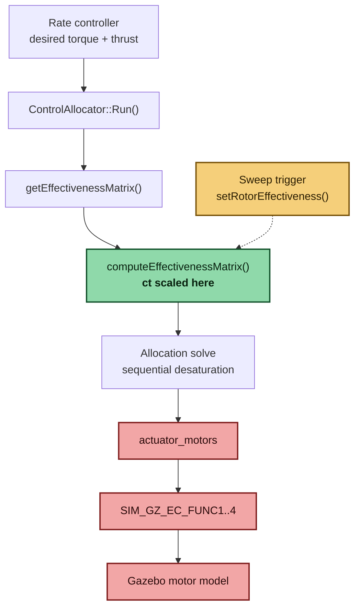
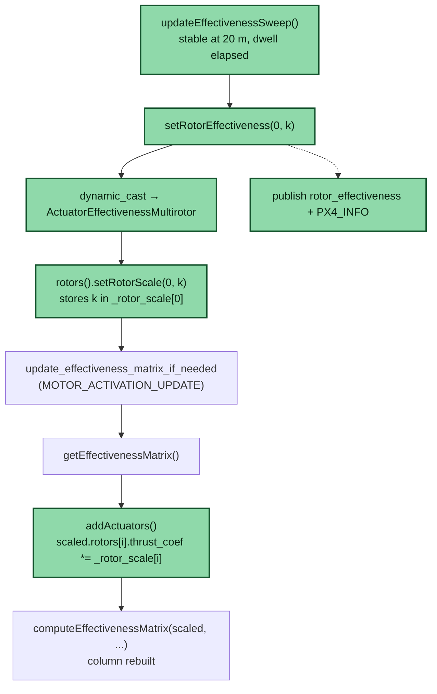
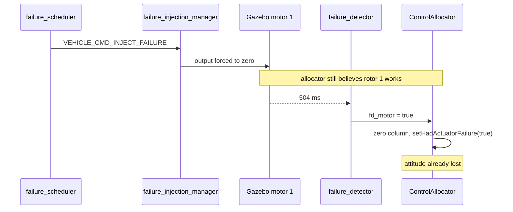
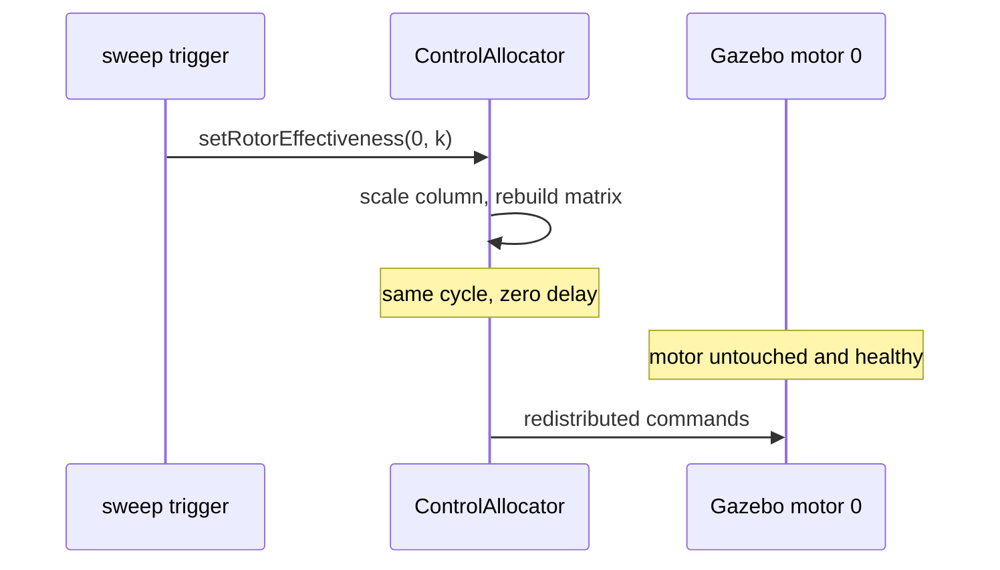

# PART 2 — PX4 Motor Effectiveness Characterization

Inter IIT Tech Meet 15.0 Prepathon · Aerial Robotics

**Firmware:** PX4-Autopilot `v1.18.0-beta1-596-g0fb3847cd9`
**Simulator:** Gazebo Harmonic (8.11.0), `gz_x500`, standard quadrotor mixer
**Host:** Ubuntu 24.04, ROS 2 Jazzy

---

## 1. Summary

A runtime mechanism that scales a selected rotor's column in PX4's
control-allocation effectiveness matrix while airborne, characterized at 100%,
75%, 50%, 25% and 0%.

The mechanism changes the allocator's *model* of the rotor; the simulated motor
is never touched. That distinction drives the result, and Section 8 develops it
against the Phase 1 reference.

**Result:** a quadrotor tolerates modelled effectiveness loss far better than an
unmodelled motor failure. At 75% and 50% the vehicle held 20 m with no
measurable change in motor commands. Failure at 25% was a loss of *thrust*
authority — smooth, coordinated, attitude-stable — rather than the immediate
loss of *attitude* control seen when a motor is cut without the allocator
knowing.

---

## 2. Repository layout

```
PART_2/
├── README.md
├── src/modules/
│   ├── control_allocator/
│   │   ├── ControlAllocator.cpp                 
│   │   ├── ControlAllocator.hpp
│   │   └── VehicleActuatorEffectiveness/
│   │       ├── ActuatorEffectivenessRotors.cpp 
│   │       ├── ActuatorEffectivenessRotors.hpp
│   │       └── ActuatorEffectivenessMultirotor.hpp
│   ├── failure_scheduler/                       
│   └── logger/logged_topics.cpp                
├── msg/
│   ├── RotorEffectiveness.msg                   
│   └── CMakeLists.txt
├── boards/px4/sitl/default.px4board             
├── ROMFS/.../airframes/4001_gz_x500             
├── logs/          phase1_reference.ulg, sweep_final_recorded.ulg, sweep_pseudoinverse.ulg
├── figures/       phase1_reference.png, sweep_final_recorded.png, effectiveness_matrix_dump.txt
├── scripts/       plot.py, times.py
└── video/         phase1_reference.mp4, phase2_sweep.mp4
```

---

## 3. Build and run

```bash
git clone https://github.com/PX4/PX4-Autopilot.git --recursive
# apply the files from src/, msg/, boards/, ROMFS/ over the clone
cd PX4-Autopilot
make px4_sitl gz_x500
```

Parameter defaults live in the airframe file, so a clean build reproduces both
runs with no manual parameter entry. QGroundControl must be connected (UDP
14550) to satisfy the GCS arming check; takeoff is commanded from there in both
phases.

**Phase 1:** `failure_scheduler start`, then take off. The module waits for a
stable 20 m hover, holds 5 s, then publishes `VEHICLE_CMD_INJECT_FAILURE`.

**Phase 2:** take off. The sweep arms itself at stable altitude and steps
through the five levels at 8 s intervals, logging each transition.

Neither phase needs console interaction during flight.

---

## 4. Phase 1 — reference behaviour

Injection is triggered from a dedicated module (`failure_scheduler`) rather than
typed at the console, so the trigger condition is identical between runs. It
subscribes to `vehicle_local_position`, waits for altitude within 1 m of 20 m
with |vz| < 0.5 m/s, holds 5 s, then publishes the command. This exercises PX4's
existing failure-handling path end to end; the allocator is unmodified.

| Parameter | Value | Note |
|---|---|---|
| `MIS_TAKEOFF_ALT` | 20 | default is 2.5 m |
| `SYS_FAILURE_EN` | 1 | enables the `failure` command |
| `CA_FAILURE_MODE` | 1 | required for `motor off`; gates the allocator's failure handling |
| `FD_ACT_EN` | 1 | actuator failure **detection** — off by default |

`FD_ACT_EN` defaults to 0, and with detection disabled there is no failure
*handling* to observe at all — the allocator simply keeps commanding a dead
rotor. Enabling it is what makes this a reference for handling.

From `logs/phase1_reference.ulg`:

```
0:00:40.108  [failure_scheduler]         Stable hover at 19.4 m - holding 5 s
0:00:45.112  [failure_scheduler]         Motor 1 failure injected at 20.0 m
0:00:45.112  [failure_injection_manager] Injected: motor off, instances 1
0:00:45.616  [control_allocator]         Stopping motors (1)
0:00:46.432  [health_and_arming_checks]  Preflight Fail: Attitude failure (roll)
```

**Detection delay: 504 ms** from injection to the allocator dropping the rotor;
a further 816 ms to the attitude failure.

Commands diverge essentially instantaneously at the allocator response. Motor 1
reaches zero within ~0.2 s; motors 2 and 3 are driven to opposite extremes and
saturate between 0 and 1 within a second. Attitude control is lost immediately
and the vehicle tumbles — expected, since a quadrotor down one rotor cannot
control yaw.

---

## 5. Phase 2 — runtime effectiveness modification

### 5.1 Where the scalar is applied



Green is the line this work changes. Red is everything the PS forbids touching —
all downstream of the allocation decision, so intervening there would change the
outputs without the allocator knowing. Amber is the only component of original
design.

`computeEffectivenessMatrix()` builds each rotor's column from its thrust
coefficient `ct` and moment ratio `km`:

```cpp
matrix::Vector3f thrust = ct * axis;
matrix::Vector3f moment = ct * position.cross(axis) - ct * km * axis;
```

`ct` is factored out of **both** expressions, so scaling it scales all six rows
of the column by the same factor — force and all three moments. That is
precisely "a scalar applied to the selected rotor's complete effectiveness
representation".

`km` is left alone deliberately: scaling it too would put k² on the yaw term and
change the rotor's torque-to-thrust ratio, a different physical claim.

### 5.2 Implementation

A per-rotor scale array on `ActuatorEffectivenessRotors`, initialised to 1.0:

```cpp
float _rotor_scale[NUM_ROTORS_MAX] {};
void setRotorScale(int idx, float k);
```

`computeEffectivenessMatrix` is `static` and cannot read a member, so rather than
change its signature, `addActuators()` builds a scaled **copy** of the geometry:

```cpp
Geometry scaled = _geometry;

for (int i = 0; i < scaled.num_rotors; ++i) {
    scaled.rotors[i].thrust_coef *= _rotor_scale[i];
}

int num_actuators = computeEffectivenessMatrix(scaled, ...);
```

Copying matters: `updateParams()` reloads geometry from the `CA_ROTOR*`
parameters, so mutating `_geometry` in place would be silently overwritten on any
parameter update, and repeated scaling would compound (0.75 then 0.5 giving
0.375 rather than 0.5).

`ControlAllocator::setRotorEffectiveness()` reaches the rotors object through a
`dynamic_cast` and triggers a rebuild:

```cpp
mc->rotors().setRotorScale(rotor, scale);
update_effectiveness_matrix_if_needed(EffectivenessUpdateReason::MOTOR_ACTIVATION_UPDATE);
```

`MOTOR_ACTIVATION_UPDATE` is the right reason: `NO_EXTERNAL_UPDATE` is
rate-limited to 100 ms, and `CONFIGURATION_UPDATE` additionally re-runs
`computeOppositeMotors()`, unnecessary because the scalar does not change
geometry. No armed-state check gates this path, so the rebuild takes effect
immediately in flight.



Green nodes are added or modified; the rest is existing PX4 code the change
routes through.

### 5.3 Live logging

A `rotor_effectiveness` uORB topic is published on every change and added to the
logger, so each transition is a timestamped, plottable signal:

```
uint64 timestamp
uint8 rotor_index
float32 scale
float32[6] column      # Mx My Mz Fx Fy Fz for that rotor
```

---

## 6. Verification: the matrix actually changes

`control_allocator status` was run at each level in flight. Rotor 0's column
(`figures/effectiveness_matrix_dump.txt`):

| Level | Mx | My | Mz | Fz | ratio |
|---|---|---|---|---|---|
| 100% | −1.13100 | 1.13100 | 0.32500 | −6.50000 | 1.000 |
| 75%  | −0.84825 | 0.84825 | 0.24375 | −4.87500 | 0.750 |
| 50%  | −0.56550 | 0.56550 | 0.16250 | −3.25000 | 0.500 |
| 25%  | −0.28275 | 0.28275 | 0.08125 | −1.62500 | 0.250 |
| 0%   | 0 | 0 | 0 | 0 | 0.000 |

Columns 1–3 unchanged throughout; every row of column 0 scales by exactly the
commanded factor. This is direct evidence that the mechanism operates on the
allocator's effectiveness representation and not somewhere downstream. At 0% the
column is fully zeroed while four actuators remain configured, so the rotor
contributes nothing and the allocator commands it to zero.

---

## 7. Characterization

Transitions at 55.3, 63.3, 71.3, 79.3 and 87.3 s
(`logs/sweep_final_recorded.ulg`, `figures/sweep_final_recorded.png`).

**100%** — applied deliberately as a control. No change in any command,
confirming the mechanism is inert at unity.

**75% and 50%** — a transient spike to ~0.85, a damped oscillation lasting
~1.5 s, then full recovery to the nominal 0.728. Altitude held at 20 m
throughout. Mean commands during the 50% dwell:

| | motor 0 | motor 1 | motor 2 | motor 3 |
|---|---|---|---|---|
| sequential desaturation (default) | 0.728923 | 0.728482 | 0.728745 | 0.728601 |
| pseudo-inverse (`CA_METHOD 0`) | 0.725491 | 0.727615 | 0.728542 | 0.728784 |

Under the default method the four commands are identical to four decimal places
even though the matrix says rotor 0 produces half its nominal force. Under
pseudo-inverse the spread is ~0.0033, about eight times larger, and ordered —
motor 0 lowest, the healthy rotors carrying more.

**25%** — all four commands drop together from 0.728 to ~0.575 within a fraction
of a second, then stay smooth and grouped for roughly four seconds while
altitude falls from 20 m to ground contact at ~83 s. Motor 0 then separates
*downward* to ~0.556 while motors 1 and 2 climb toward 0.65. Two things are
notable: the failure is in thrust rather than attitude, so the vehicle descends
under control; and the allocator uses the degraded rotor *less*, leaning on the
rotors that can actually deliver.

**0% — not characterized in flight.** The transition fired at 87.3 s, after
ground contact at ~83 s, so the command chaos after 87 s is the crash rather
than the allocation. The 0% column is verified statically in Section 6, but its
flight response was not captured at altitude in this run.

---

## 8. Comparison with the Phase 1 reference

Both mechanisms converge on the same call —
`update_effectiveness_matrix_if_needed(MOTOR_ACTIVATION_UPDATE)`. Everything
before it differs.

| | Phase 1 (injection) | Phase 2 (effectiveness scaling) |
|---|---|---|
| Trigger | failure detector, via `fd_motor` | direct model change |
| Delay | 504 ms | none — same cycle |
| What changes | motor stops; allocator initially unaware | allocator's model; motor stays healthy |
| Column at failure | zeroed by `_handled_motor_failure_bitmask` | zeroed by the scalar |
| `setHadActuatorFailure` | set true — freezes normalisation | never set |
| Opposite-rotor logic | looked up; no effect on a quad | not involved |
| Failure mode | attitude control lost immediately | thrust authority lost progressively |
| Onset | divergence within 0.2 s | ~4 s of controlled descent |





PX4's injection stops the rotor **without** telling the allocator, which then
keeps demanding torque from a rotor producing none; attitude error compounds and
commands saturate within a second. Scaling changes the model consistently, so
the allocator never asks for something the vehicle cannot do — it redistributes
correctly and fails only when demand genuinely exceeds what three rotors can
supply.

---

## 9. Limitations

- **0% was not characterized at altitude.** See Section 7.
- **The 8 s dwell is arbitrary** — long enough for a steady state, short enough
  to reach several levels in one flight. Not tuned against a settling-time
  criterion.
- **Levels are applied cumulatively** in a single flight, so the 25% response
  follows a vehicle that has already passed through 75% and 50%. Two independent
  runs produced the same transition behaviour, but this does not fully rule out
  path dependence.
- **`NAV_DLL_ACT` and `NAV_RCL_ACT` were temporarily set to 0** during early
  bring-up to arm without a ground station. Both were restored to defaults for
  all recorded runs.

---

## 10. Reproducing the figures

```bash
ulog2csv logs/sweep_final_recorded.ulg -o csv_final/
python3 scripts/times.py        # transition times
python3 scripts/plot.py         # altitude + motor commands, with markers
```

`times.py` reads transitions from both the console messages and the
`rotor_effectiveness` topic; the two should agree.

---

## 11. Author

**Amartya Mishra**
B.Tech Electrical Engineering, IIT (BHU) Varanasi

GitHub: [@Amartya106](https://github.com/Amartya106)

EMail: amartyac106@gmail.com, amartya.mishra.eee25@itbhu.ac.in
